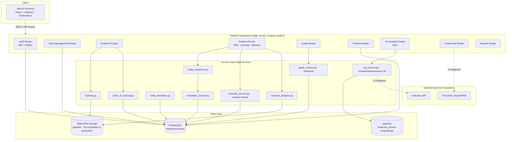
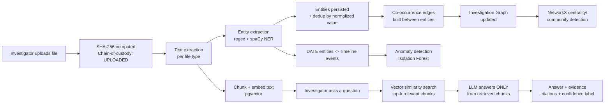
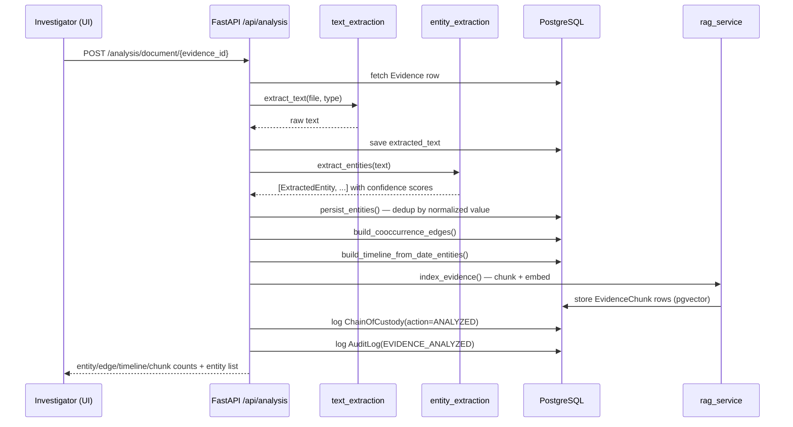
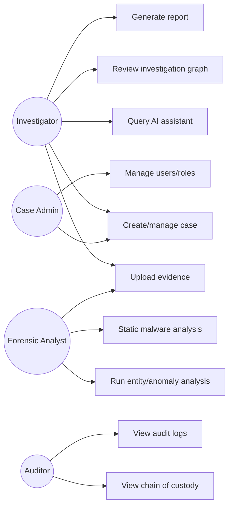
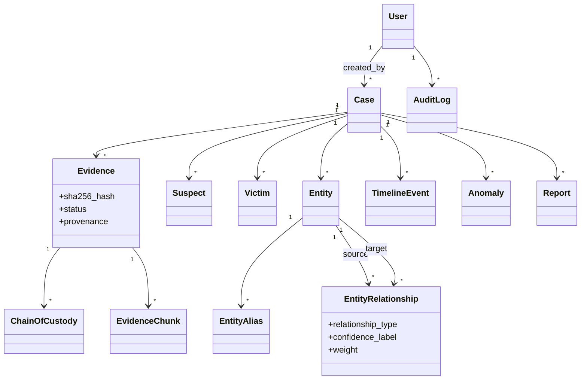
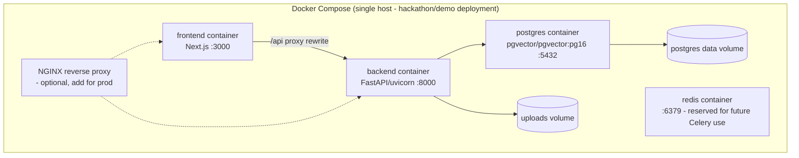

# FORGE-AI — System Architecture

## 1. High-level architecture

**Why a single FastAPI service instead of the spec's per-module
microservices**: at hackathon/case-management scale, one modular
monolith with clean router/service boundaries is faster to build,
easier to reason about for a security review, and trivially splittable
later — each `app/api/*.py` + its backing `app/services/*.py` is
already a natural service boundary if/when the platform needs to scale
horizontally (e.g., the AI/RAG router is the first candidate to split
out, since embedding + LLM calls are the most latency/resource heavy).

## 2. Data flow — evidence to investigative answer

## 3. Sequence diagram — "Analyze this evidence" request

## 4. Use case diagram

## 5. Core class relationships (simplified)

## 6. Deployment diagram

For a real deployment: put NGINX (or a managed load balancer) in front,
terminate TLS there, move `uploads/` to S3-compatible object storage,
and run Postgres as a managed instance with automated backups —
evidence integrity depends on the database surviving.

## 7. Why these simplifications, and the upgrade path

| Spec component | This build | Upgrade path |
|---|---|---|
| Neo4j graph DB | Postgres tables + NetworkX at query time | Add a Neo4j sync step in `correlation_service.py`; swap `graph_service.py`'s NetworkX calls for Cypher queries once graphs exceed a few thousand nodes per case |
| Celery async processing | Synchronous request-time processing | Wrap each `app/services/*` call in a Celery task; Redis is already in the compose stack and unused, ready for this |
| DOCX/PDF report export | Structured JSON (canonical) | Feed `report.content_json` into a DOCX template (python-docx) or PDF renderer |
| Full microservices | Modular monolith | Each `app/api/*.py` + service pair is already a clean extraction boundary |
