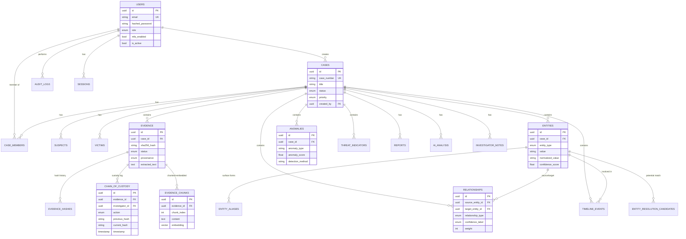

# FORGE-AI — Database Schema

PostgreSQL 16 + the `pgvector` extension (for `evidence_chunks.embedding`).
Full definitions live in `backend/app/models/models.py`; this is the
reference ER diagram and table-by-table summary.

## Entity-relationship diagram

## Table reference

| Table | Purpose |
|---|---|
| `users` | Investigator accounts; role drives RBAC permission set |
| `sessions` | Refresh-token sessions (revocable, IP/user-agent logged) |
| `audit_logs` | Every mutating/sensitive action across the platform |
| `notifications` | Per-user notification inbox |
| `cases` | The investigation itself — status, priority, ownership |
| `case_members` | Who's on a case, and in what role-on-case |
| `suspects` / `victims` | Named parties on a case, optionally linked to an `Entity` |
| `investigator_notes` | Free-text notes — tagged `provenance = INVESTIGATOR_NOTES` |
| `case_tasks` | Lightweight task tracking per case |
| `comments` | Case-level discussion thread |
| `evidence` | One row per uploaded file — hash, type, status, extracted text |
| `evidence_hashes` | Hash history — supports re-verification over time |
| `chain_of_custody` | **Append-only.** Every touch of evidence, with prev/current hash |
| `evidence_chunks` | RAG pipeline — chunked evidence text + pgvector embedding |
| `entities` | Extracted/normalized entities (18 types per Module 4) |
| `entity_aliases` | Alternate surface forms of the same entity across sources |
| `entity_resolution_candidates` | Scored potential-match pairs — never auto-merged |
| `relationships` | Graph edges between entities, with confidence label + weight |
| `timeline_events` | Unified forensic timeline, filterable by entity/type/date |
| `ai_analysis` | Every AI assistant query + answer + cited evidence IDs |
| `anomalies` | ML-flagged anomalies with score, method, and reason |
| `threat_indicators` | IOC enrichment results (or "unavailable" record) |
| `reports` | Generated structured reports (JSON canonical, DOCX/PDF export) |

## Design notes

- **UUID primary keys everywhere** — avoids sequential-ID enumeration
  and makes cross-case data merges (e.g. multi-agency evidence sharing)
  collision-free.
- **`provenance` / `confidence_label` enums are load-bearing**, not
  decorative — they're what lets the UI and reports visually separate
  `ORIGINAL_EVIDENCE` from `AI_GENERATED_ANALYSIS` from
  `INVESTIGATOR_NOTES` (Module 19's core requirement).
- **`chain_of_custody` is intentionally append-only** at the application
  layer (no update/delete endpoint exists for it). In a production
  deployment this should also be enforced at the database role level
  (revoke `UPDATE`/`DELETE` grants on that table for the app's DB user).
- **`entities.normalized_value`** is what `correlation_service.py`
  dedupes against — same entity type + same normalized value = the same
  `Entity` row, so mentions across many evidence items collapse into
  one node rather than duplicating the graph.
