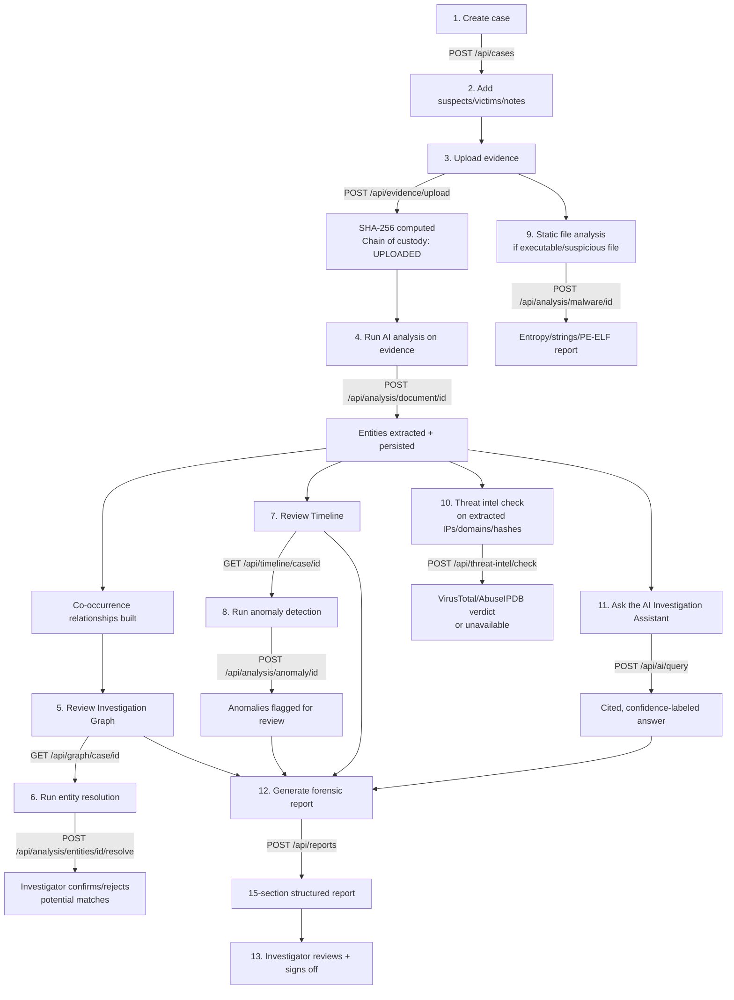

# FORGE-AI — Forensic Investigation Workflow

This is the intended end-to-end path an investigator takes through the
platform, and which module/endpoint handles each step.

## Investigator-facing walkthrough

1. **Create the case.** Set title, crime type, and priority. You're
   automatically added as the lead investigator.
2. **Upload evidence** — any of the supported formats (PDF, TXT, CSV,
   JSON, XML, PCAP, LOG, DOCX, images, ZIP). The system hashes it
   immediately (SHA-256) and logs an `UPLOADED` chain-of-custody event
   before anything else happens.
3. **Run AI analysis** on each evidence item. This extracts entities
   (people, phones, emails, IPs, domains, bank accounts, crypto wallets,
   etc.), links entities that co-occur in the same document, seeds the
   timeline from any date references, and indexes the text for the AI
   assistant — all in one call.
4. **Review the Investigation Graph.** Nodes are entities, edges are
   relationships (initially `MENTIONED_IN` / `POTENTIAL_CONNECTION` from
   co-occurrence — upgrade the label once you've verified a real
   relationship like `CALLED` or `TRANSFERRED_MONEY`). Centrality and
   community-detection scores surface potentially important nodes — read
   the on-screen disclaimer: these are leads, not proof.
5. **Run entity resolution** to see if any two entities (e.g. "R. Kumar"
   and "rahul.kumar@gmail.com") might be the same real person. You
   confirm or reject each suggestion — nothing merges automatically.
6. **Review the timeline** — every dated event across all evidence, in
   one chronological, filterable view.
7. **Run anomaly detection** once you have enough timeline events (8+).
   Isolation Forest flags statistically unusual activity — off-hours,
   weekend spikes, rare event patterns for a given entity.
8. **Check threat intelligence** on any extracted IP/domain/hash if you
   have VirusTotal/AbuseIPDB configured.
9. **Ask the AI assistant** anything about the case — it only answers
   from what's actually been indexed, cites the evidence it used, and
   tells you plainly when there isn't enough evidence to answer.
10. **Generate the report.** Pulls everything above into the 15-section
    structured report, with the AI-generated section clearly separated
    from original evidence and your own notes.

## What the AI is *not* allowed to do at any step

- Declare a suspect guilty, dangerous, or responsible for a crime.
- State a fact that isn't traceable to a specific evidence excerpt.
- Silently merge two entities during resolution.
- Modify or delete a chain-of-custody record.
- Present a threat-intelligence verdict when no provider was reachable.
